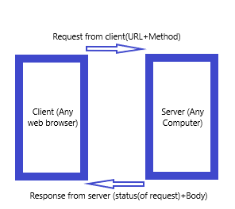

# Movies-Library

### Project :  Movies-Library #1

### Author: Malak Odtalla

### WRRC

### Overview

Project for building a movie app that can check the latest movies based on categories.

### Getting started
The steps that must follow to built this App:
<ul>
<li>first  user should create a new repo then clone it.</li>
<li>Create Node enviroment by type; (npm init) in the terminal.</li>
<li>Installa express framework;type (npm install express).</li>
<li>open vs code.</li>
<li>create new file.js to start bulding a server.</li>
<li>The code in the js file must follow those steps: 
1- require the package. 
2- express app. 
3- create fun to listening to any request. 
4- to reach a json data we need to create an array of objects by creating constructor. 
5- create routes(endpoints) to establish a connection between user and server. 
6- The steps above for request data that is stored in a json file, but if we need to request data from a 3rd API, we need to search for the specifce API in the internet related to our project then then get the key to put it in our request for the authentication reasons. 
7- Also  we can start sending and recieving data from the database using RESTful API-GRUD(Great,Read,Update,Delete), so here we bulit a database with one table, and applied the greate and read process on the database, which mean that when a client send a requset to the server, the server can send the respose with the data from the database, or it can apply or save it to the DB, and to achieve this process  we need to a tool that helps in connect DB to the server, like (postgress)  
8- In the last phase in this project, I complete working on GURD, and started updating and deleting from the database through my server.

*note* -- To run the server from terminal type (node.index.js) or (nodemone) after install it.

</ul>

### Project features

Project features consist of:
- Home route; that when hit it, the server response and gives the data we need from json file.
- Favirout route; which gives the welcoming massege as response. 

- Trending route; showing the list of trending movies.
- search route; searching for specifc movie by its id.
- certification route; Get an up to date list of the officially supported movie certifications on TMDB
- watchProviders route;Returns a list of all of the countries the themoviedb org have watch provider (OTT/streaming) data for .

- postMovies route; this route help in add rows to database.
- getMovies route; this route shows the list of movies that inside the database.

- updateMovies rout; helps in updates the records in the DB.
- DeletMovies rout;  helps in delete records in the DB.

